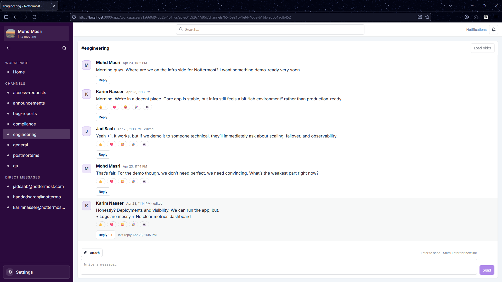
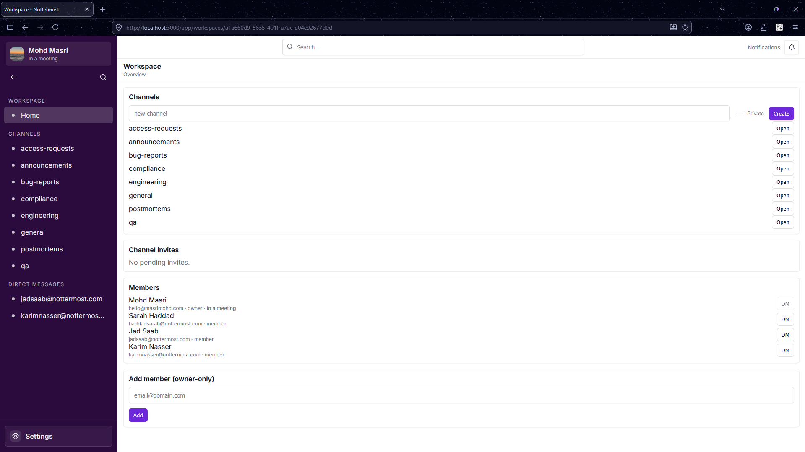
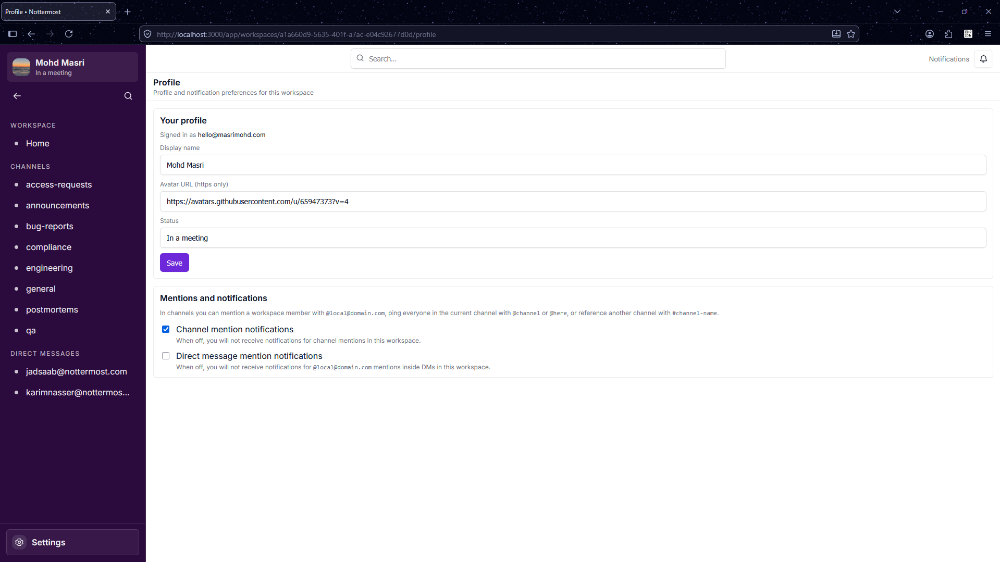

# Nottermost

A **Mattermost-inspired** team chat platform built as a **distributed system on AWS**. The scope is intentionally **minimal but essential** to exercise real architecture, operations, and cost trade-offs end to end.

## ✨ Overview

Nottermost allows users to:

- Create and manage workspaces
- Communicate via channels and direct messages
- Collaborate in real-time with threads, reactions, and mentions
- Share files with proper access control
- Search across messages and conversations

## 🚀 Demo

> _Coming soon_

Planned demo will include:

- Creating a workspace
- Inviting members
- Sending messages in channels and DMs
- Realtime updates across multiple clients
- Threaded conversations
- File uploads and previews

---

## Screenshots

### Conversation view

Direct message conversation with real-time delivery, reactions, and message history.

---

### Channel directory

Browse and discover channels within a workspace, with clear separation between public and private spaces.

---

### Profile settings

Update your profile details and preferences (e.g., display name, avatar, and account-related settings).

---

## Core Concepts

### Workspaces

A workspace is the top-level container.

It represents a team, organization, or group of users.

Each workspace includes:
- Members
- Channels
- Direct messages
- Shared resources

---

### Channels

Channels are group conversations inside a workspace.

They can be:
- **Public** – visible to all workspace members
- **Private** – invite-only access

Features:
- Message history with pagination
- Mentions (`@user`, `@channel`)
- Reactions
- Threaded replies

---

### Direct Messages (DMs)

Private conversations between users.

Supports:
- 1:1 chats
- Multi-user group conversations
- Persistent message history

---

### Threads & Replies

Messages can have replies, forming threads.

This allows:
- Focused side discussions
- Reduced noise in main channels
- Clear conversation structure

---

### Realtime Messaging

Messages are delivered instantly using WebSockets.

Supports:
- Live message updates
- Typing indicators
- Reaction updates
- Read-state changes

---

### Files & Attachments

Users can upload and share files within conversations.

Includes:
- File previews
- Access control (workspace/channel scoped)
- Download permissions

---

### Search

Global search allows users to find:

- Messages
- Channels
- Conversations

With filtering capabilities for better navigation.

---

### User Profiles

Each user has:

- Display name
- Avatar
- Status
- Editable profile information

<!-- CHECKPOINT id="ckpt_mobw9bt7_x91d67" time="2026-04-23T19:48:17.035Z" note="auto" fixes=0 questions=0 highlights=0 sections="" -->

<!-- CHECKPOINT id="ckpt_mobwm6s0_fekcky" time="2026-04-23T19:58:17.040Z" note="auto" fixes=0 questions=0 highlights=0 sections="" -->

<!-- CHECKPOINT id="ckpt_mobwz1qs_goylh8" time="2026-04-23T20:08:17.044Z" note="auto" fixes=0 questions=0 highlights=0 sections="" -->

<!-- CHECKPOINT id="ckpt_mobxbwpr_1uzqxb" time="2026-04-23T20:18:17.055Z" note="auto" fixes=0 questions=0 highlights=0 sections="" -->
